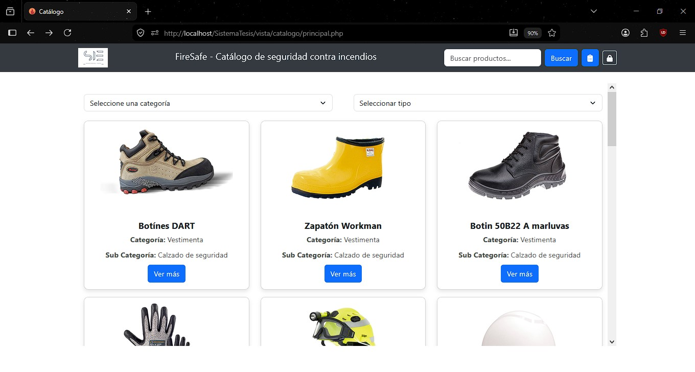
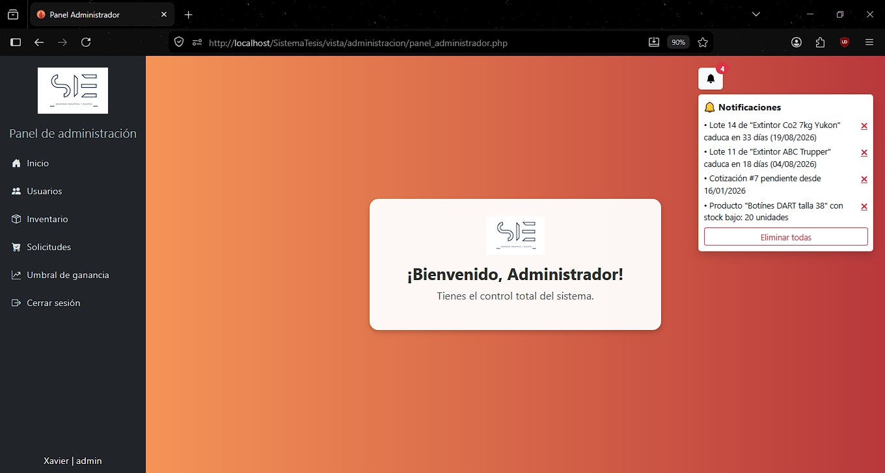
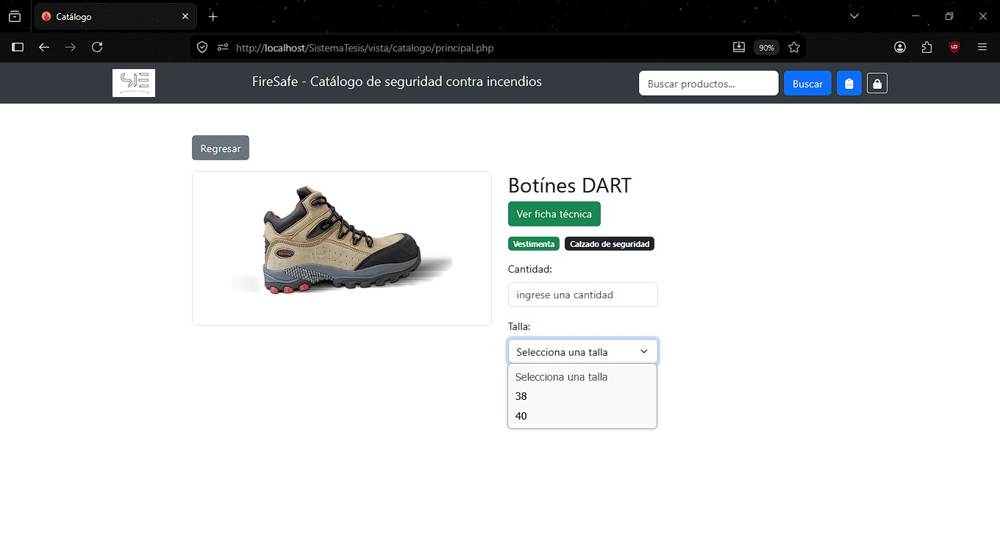
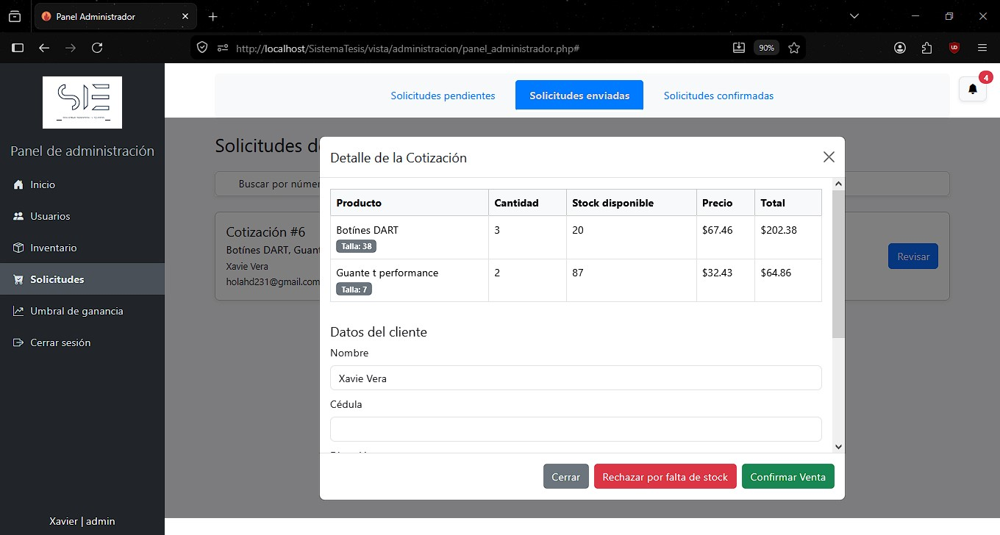
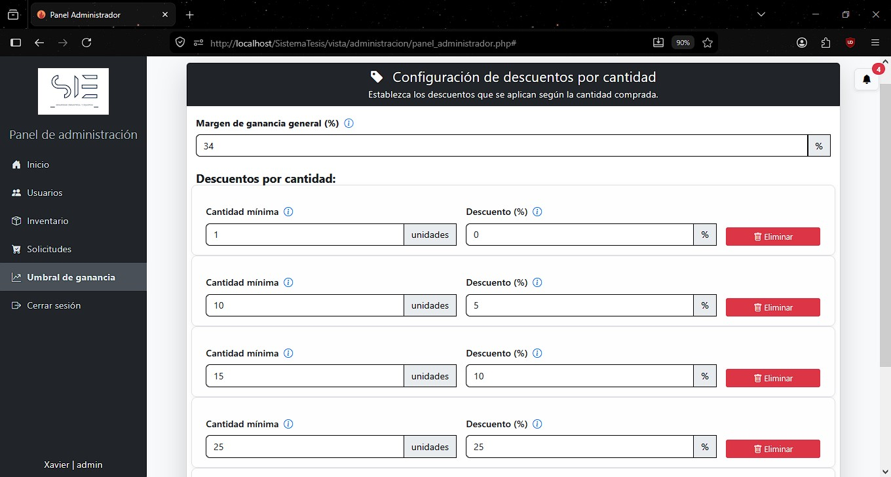
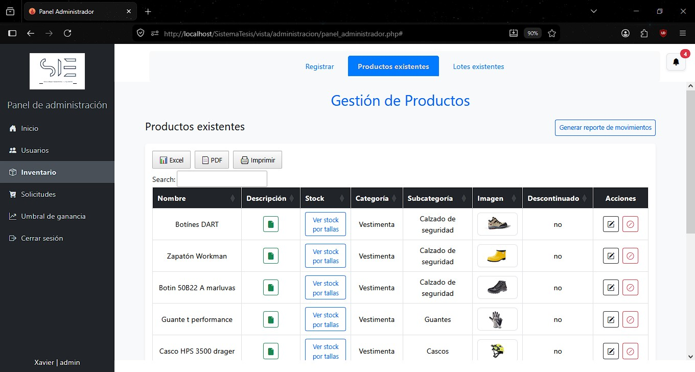

# 📋 Sistema Web de Productos de Seguridad Contra Incendios y Control de Vencimiento de Extintores - PREVENCO

Este sistema web fue desarrollado como proyecto de grado para la obtención del título de Tecnólogo en Desarrollo de Software en el Instituto Superior Tecnológico "17 de Julio". La plataforma toma como escenario a la empresa PREVENCO (Ibarra, Ecuador) con el fin de digitalizar, centralizar y optimizar sus flujos de inventario y ventas.

---

## El Problema Real
PREVENCO coordinaba las áreas de inventario y ventas mediante hojas de cálculo tradicionales. Esto provocaba desorden en la información, errores de escritura, duplicidad de registros, falta de sincronización del stock en tiempo real y riesgos de pérdida de datos históricos. Asimismo, complicaba el seguimiento riguroso de las fechas de mantenimiento y caducidad de los lotes de extintores y equipos de seguridad.

## La Solución
El sistema centraliza las tareas operativas en una única plataforma web, permitiendo la comunicación fluida entre el encargado de inventario y el encargado de ventas. El software no gestiona pasarelas de pago ni logística de envíos; se enfoca estrictamente en la automatización del catálogo público, la gestión avanzada de stock por lotes y un flujo controlado de cotizaciones dinámicas.

---

## Stack Tecnológico
* **Backend:** PHP (Desarrollo estructurado a medida para optimizar el rendimiento del servidor local).
* **Frontend:** HTML5, CSS3, JavaScript, jQuery y el framework Bootstrap.
* **Base de Datos:** MySQL (Modelo Entidad-Relación optimizado para la consistencia de datos).
* **Servidor de Despliegue:** Internet Information Services (IIS) en entorno localhost.
* **Metodología de Desarrollo:** Extreme Programming (XP), trabajando mediante iteraciones basadas en historias de usuario.

---

## Módulos y Funcionalidades Destacadas

### 1. Gestión de Inventario Avanzada (Por Lotes y Categorías Dinámicas)
* **Atributos Dinámicos:** El formulario de registro de productos adapta sus campos según la categoría seleccionada (ej. peso/capacidad para extintores frente a tallas para vestimenta de seguridad).
* **Control de Lotes:** Registro minucioso de entradas, procedencia del proveedor, costo unitario y fechas de ingreso.
* **Trazabilidad de Caducidad:** Control específico para productos perecederos o extintores que requieren mantenimiento periódico.
* **Historial Seguro:** Opción de "descontinuar" productos para preservar la integridad de los datos históricos de ventas sin eliminarlos de la base de datos.

### 2. Flujo Automatizado de Cotizaciones y Ventas
* **Catálogo Público:** Interfaz limpia para el cliente con barras de búsqueda y filtros por categoría/subcategoría que lee directamente el stock real disponible.
* **Solicitudes en Línea:** Los clientes estructuran su pedido y envían la solicitud ingresando su correo electrónico y su número de teléfono.
* **Precios Sugeridos Automatizados:** El sistema calcula de forma automática un precio sugerido al público basándose en el porcentaje de ganancia configurado por el Administrador.
* **Descuentos por Volumen Automáticos:** Aplicación de reglas de negocio dinámicas (ej. reducción automática de un porcentaje si el pedido supera un umbral de unidades determinado).
* **Cierre del Ciclo:** El encargado de ventas procesa la solicitud, ajusta valores si es necesario y envía un PDF adjunto por correo electrónico. Al confirmarse la compra por vía externa, se valida en el sistema y se resta automáticamente el stock del inventario.

### 3. Seguridad y Configuración de Reglas de Negocio
* **Roles de Acceso Restringidos:** Separación estricta de funciones en el backend para el Administrador, Encargado de Ventas y Encargado de Inventario.
* **Redirección Obligatoria:** El sistema detecta cuentas nuevas o contraseñas restablecidas por el administrador, forzando al usuario a cambiar sus credenciales en su primer inicio de sesión.
* **Módulo de Notificaciones:** Alertas visuales segmentadas por rol sobre stock bajo, cotizaciones pendientes de revisión y lotes próximos a expirar.

---

## Vista Previa del Sistema

| Interfaz del Catálogo Público | Panel de Administración Central |
|---|---|
|  |  |

| Interfaz del producto | Vista previa de la cotizacion |
|---|---|
|  |  |

| Panel de configuracion de margen de ganancia | Vista previa de la gestion de productos|
|---|---|
|  |  |

---
**Autor:** Xavier Alfredo Vera Guerra  
**Institución:** Instituto Superior Tecnológico "17 de Julio"  
**Año de Finalización:** 2025
